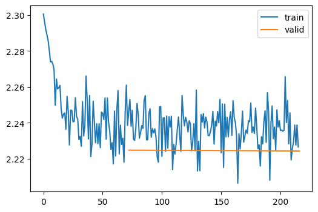
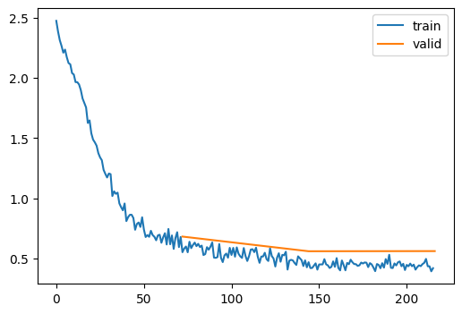

---
author:
- Alex Kelly
draft: false
jupyter: python3
title: The importantance of propper initializtaion
title-block-banner: true
toc-title: Table of contents
---

# Why am I writing about LSUV?

I'm watching online videos series by Fast.ai where we are looking at
re-creating neural networks from scratch using Python ensuring we fully
understand inner workings of each aspect of a neural network. This will
allow me to create new techniques and improve existing techniques and
enable me to piece together the right neural network for the right task.

On top of that we meet up online for a study group and share/discuss
what we have been studying. This blog post is why we need a better way
to initialize weights than just choosing random values.

# Why initialization model weights before starting the optimization


Proper initialization can affect how quickly the model converges to a
minimum loss, or even whether it converges at all. It's not just about
the initialization of the 1st layer of weights, its about all of the
layers weights from the 1st to the last.

Here are a few key points on weight initializations:

1.  The hardware has floating point limitations that mean it processes a
    limited number of bits and stores in a limited amount of memory. if
    the weights are too high or too low, then the resulting calculations
    can exceed the numerical range that can be represented in the
    specified memory, leading to what is known as exploding or vanishing
    gradients (i.e.. inactive neurons) at any level in the neural
    network. This results in information lost, which are called inactive
    neurons or neurons that dont contribute to the end result in a
    optimal way.\
2.  The mean should be close to zero, if the number is far away from
    zero, you will more likely end up with exploding or vanishing
    neurons (i.e.. dead neurons) that don't contribute to the end
    prediction or classification. Enforcing a mean of zero is a way to
    optimize the weights so when calculated against the inputs they give
    a optimal result in the floating point range that the hardware can
    handle.
3.  The standard deviation should be near 1 so that the values don't
    vary too far from the mean (i.e. 0 mentioned in point 2). A standard
    deviation that's too high or too low could lead to weights that are
    too disparate or too similar, affecting the learning dynamics.

# LSUV vs other weight optimization techniques

Each model comes with its own issues and choosing the right
initialization model is key to success. Some initializations work better
with large models, some with small and some depend on the activation
functions, sometimes you have to experiment to see which ones work best
with your data and model. Here are a few examples of initialization
techniques and when to use them :

-   LSUV (Layer-Sequential Unit-Variance) Initialization: Initializes
    neural network weights in a way that the variance of the outputs of
    each layer is unitary, aiming to combat the vanishing and exploding
    gradient problem.

-   Zero Initialization: Sets all the initial weights of the neural
    network to zero, often leading to poor performance as all neurons in
    a layer will learn the same features during training.

-   Random Initialization: Assigns weights to neural network layers
    randomly, usually from a Gaussian or uniform distribution, to break
    symmetry and ensure different neurons can learn different functions.

-   Xavier/Glorot Initialization: Sets the initial weights according to
    a scaled uniform distribution, which is based on the number of input
    and output neurons, designed to keep the gradients in a reasonable
    range.

-   He Initialization: Uses a scaled uniform or normal distribution
    based on the number of input neurons to initialize weights,
    especially suitable for layers with ReLU activation to preserve
    gradient variance.

-   LeCun Initialization: Initializes weights with a scaled normal
    distribution where the scaling is based on the number of input
    neurons, recommended for layers followed by linear or sigmoid
    activations.

LSUV is a valuable weight initialization technique, especially for
deeper architectures where traditional techniques might not be as
effective. However, the choice of weight initialization should be based
on the network architecture, activation function, and specific
challenges of the problem at hand.

# The following sections guide you through the code along with comments and reflections on the results

The aim of the notebook is create my own callback using LSUV, along the
way we will start with the simplest of models and build up to more
complex models, viewing and critiqueing the results along the way. All
the code and data is here to recreate the results.

We will be covering :

-   Setting up the environment, loading the data set
-   finding the learning rate
-   learner without LSUV or any other initialization techniques and
    exploring the results.
-   learner wtih Standardizing inputs with no weights optimization
    techniques
-   learner with Batch Normalization with Leaky ReLU activation and
    Kaiming normalization.
-   LSUV training method

each of the learner sections where we will be running the model will
have the following charts :

`<br>`{=html} **loss and accuracy :** learner loss and accuracy for the
training and validation data sets `<br>`{=html} **Color_dim :** The
color represents the frequency of activations in a specific range. We're
using the Viridis colormap, yellow indicates higher frequencies (many
activations in that range), and purple indicates lower frequencies. So,
areas with more intense yellow mean those activation values occur more
frequently along the (y axis) for that batch (X axis). Ideally want the
yellow spread accross the y axis which you will see demostrated across
the sections. `<br>`{=html} **Dead_chart :** Shows how many inactive
neurons there are, 1 being all neurons are inactive and 0 meaning no
neurons are inactive. Having more neurons contributing the the results
is better. `<br>`{=html} **Plot_stats :** Means close to zero but
standard deviations far off expected goal of 1, to far from 1 to train
optimally. `<br>`{=html} `<br>`{=html} - and finally the conclusion of
the results

# Setup environment, loading the dataset, transforming the data for training

This code sets up a pipeline to preprocess and load the Street View
House Numbers (SVHN) dataset for machine learning with PyTorch. It
installs required packages, imports libraries, configures settings,
fetches the dataset, converts images to grayscale, applies data
transformations, and creates data loaders for training.

::: {.cell outputId="57f9d48a-b16e-426e-ff9f-2e9a6438567c"}
``` {.python .cell-code}
# install required libraries
!pip install datasets
!pip install torcheval

# Python Standard Library imports
import math
import logging
from collections.abc import Mapping
from operator import attrgetter
from functools import partial
from copy import copy
from contextlib import contextmanager
import random

# Third-party library imports
import torch
import matplotlib.pyplot as plt
import matplotlib as mpl
import torchvision.transforms.functional as TF
from datasets import load_dataset, load_dataset_builder
import fastcore.all as fc
from fastprogress import progress_bar, master_bar
from fastcore.test import test_close
from torch.nn import init
from torch import nn,tensor
from torch import optim
import torch.nn.functional as F
from torcheval.metrics import MulticlassAccuracy, Mean
import numpy as np

# Custom module imports
from conv import *
from miniai.datasets import *
from miniai.conv import *
from miniai.learner import *
from miniai.activations import *

# Configuration settings
torch.set_printoptions(precision=2, linewidth=140, sci_mode=False)
torch.manual_seed(1)
mpl.rcParams['image.cmap'] = 'viridis'
logging.disable(logging.WARNING)


# get labels
x,y = 'image','label'

#  Street View House Numbers dataset name
name = ('svhn')

# fetch dataset from hugging face
dsd = load_dataset(name, "cropped_digits",)

# remove extra (not required for initial run through)
dsd.pop("extra")

# convert images to greyscale
def convert_to_gray(batch):
    image = batch['image']
    if image.mode != 'L':  # Only convert if not already grayscale
        gray_image = image.convert('L')
        batch['image'] = gray_image
    return batch

# Apply to all datasets
for key in dsd.keys():
    dsd[key] = dsd[key].map(convert_to_gray, batched=False)

# transform data
@inplace
def transformi(b): b[x] = [torch.flatten(TF.to_tensor(o)) for o in b[x]]

# extract data set
bs = 1024
tds = dsd.with_transform(transformi)
dls = DataLoaders.from_dd(dd=tds, batch_size=bs, num_workers=1)


dt = dls.train
xb,yb = next(iter(dt))
xb.shape,yb[:10]

```
:::

# Find the optimal learning rate

The Learning Rate Finder is a tool designed to help find a good learning
rate for training deep learning models. It increases the learning rate
after each mini-batch and records the loss. As the learning rate
increases, initially, the loss will decrease (as the model learns). But
after a certain point, the learning rate might be too high causing the
loss to increase due to overshooting the optimal weights. The usual
method is to choose the best learning rate is to choose a figure just
before the steep fall.

::: {.cell outputId="959aa7bf-512b-4968-8322-8c3d64764be8"}
``` {.python .cell-code}
# transform dataset and loader
@inplace
def transformi(b): b[x] = [TF.to_tensor(o) for o in b[x]]

tds = dsd.with_transform(transformi)
dls = DataLoaders.from_dd(tds, bs, num_workers=2)
dt = dls.train

lrfind = LRFinderCB()
cbs = [TrainCB(), DeviceCB(), lrfind]

# fits data
def fit(model, epochs=1, xtra_cbs=None):
    learn = Learner(model, dls, loss_func=F.cross_entropy, lr=0.0000001, cbs=cbs+fc.L(xtra_cbs))
    learn.fit(epochs)
    return learn

# conv function takes in kernal size, stride (how many elements are skipped) and padding (number of zeros added to the edge of the input data)
# along with ni (features) input channels and output channels (feature maps)

def conv(ni, nf, ks=3, act=True):
    res = nn.Conv2d(ni, nf, stride=2, kernel_size=ks, padding=ks//2)
    if act: res = nn.Sequential(res, nn.ReLU())
    return res

#

def cnn_layers():
    return [
        conv(1 ,8, ks=5),        #14x14
        conv(8 ,16),             #7x7
        conv(16,32),             #4x4
        conv(32,64),             #2x2
        conv(64,10, act=False),  #1x1
        nn.Flatten()]

model = nn.Sequential(*cnn_layers())

fit(model);

plt.plot(lrfind.lrs, lrfind.losses)
plt.xscale('log')

```

::: {.cell-output .cell-output-display}

:::
:::

# Example of poorly initialized model (No input or weight initialization)

It will show training pipeline and corresponding metrics visualized
through various charts. Annotations provide insights into the model's
performance during training.

By paying attention to these key metrics and visual cues, we can assess
the shortcomings in the input initialization and training regimen,
specifically issues such as inactive neurons and poorly tuned input
standardization (also know as input initializations). We can then
compare them against previously un-initialized inputs and see any
improvements. `<br>`{=html} `<br>`{=html} **Key technical information
for this section :** `<br>`{=html} `<br>`{=html} **Conv 1,8,16,32,64 -\>
10 :** A Convolution neural network showing the number of filters in
each layer and ending with 10 output units. `<br>`{=html} **Activation
is nn.ReLU :** ReLU function introduces non-linearity to the model.
`<br>`{=html} **Data normalisation :** None `<br>`{=html} **weight
normalization :** None `<br>`{=html}

::: {.cell outputId="99933d23-14cf-4409-f93b-174b17e1e5ca"}
``` {.python .cell-code}
# improved function to include labelling for the stats
class ActivationStats(HooksCallback):
    def __init__(self, mod_filter=fc.noop):
        super().__init__(append_stats, mod_filter)

    def color_dim(self, figsize=(11,5)):
      fig, axes = get_grid(len(self), figsize=figsize)
      for ax, h in zip(axes.flat, self):
          im = ax.imshow(get_hist(h), origin='lower')  # Using imshow directly

          # Add labels, title, and colorbar for clarity
          ax.set_xlabel("Batch Number")
          ax.set_ylabel("Activation Value")
          ax.set_title("Layer " + "str(self.index(h))" + " Activations")
          cbar = plt.colorbar(im, ax=ax)
          cbar.set_label("Frequency")
      plt.tight_layout()  # Prevent overlap


    def dead_chart(self, figsize=(11,5)):
        fig, axes = get_grid(len(self), figsize=figsize)
        for ax, h in zip(axes.flatten(), self):
            ax.plot(get_min(h), linewidth=3)
            ax.set_ylim(0,1)
            ax.set_xlabel("Batch Number")
            ax.set_ylabel("Activation Value")
            ax.set_title("Layer " + "str(self.index(h))" + " Dead Activations")
        plt.tight_layout()  # Prevent overlap

    def plot_stats(self, figsize=(10,4)):
        fig, axs = plt.subplots(1,2, figsize=figsize)
        for h in self:
            for i in 0,1:
                axs[i].plot(h.stats[i])
        axs[0].set_title('Means')
        axs[1].set_title('Stdevs')
        axs[0].set_xlabel("Batch Number")
        axs[1].set_xlabel("Batch Number")
        axs[0].set_ylabel("Mean Activation Value")
        axs[1].set_ylabel("Standard Deviation of Activation Value")
        plt.legend(fc.L.range(self))
        #plt.tight_layout()  # Prevent overlap

# transform dataset and loader
@inplace
def transformi(b): b[x] = [TF.to_tensor(o) for o in b[x]]

tds = dsd.with_transform(transformi)
dls = DataLoaders.from_dd(tds, bs, num_workers=2)
dt = dls.train

# setup model for learning
metrics = MetricsCB(accuracy=MulticlassAccuracy())
cbs = [TrainCB(), DeviceCB(), metrics, ProgressCB(plot=True)]

# fits dataset
def fit(model, epochs=3, xtra_cbs=None):
    learn = Learner(model, dls, loss_func=F.cross_entropy, lr=0.2, cbs=cbs+fc.L(xtra_cbs))
    learn.fit(epochs)
    return learn

# conv function takes in kernal size, stride (how many elements are skipped) and padding (number of zeros added to the edge of the input data)
# along with ni (features) input channels and output channels (feature maps)
def conv(ni, nf, ks=3, act=True):
    res = nn.Conv2d(ni, nf, stride=2, kernel_size=ks, padding=ks//2)
    if act: res = nn.Sequential(res, nn.ReLU())
    return res

#
def cnn_layers():
    return [
        conv(1 ,8, ks=5),        #14x14
        conv(8 ,16),             #7x7
        conv(16,32),             #4x4
        conv(32,64),             #2x2
        conv(64,10, act=False),  #1x1
        nn.Flatten()]
model = nn.Sequential(*cnn_layers())

#astats = ActivationStats(fc.risinstance(GeneralRelu))
astats = ActivationStats(fc.risinstance(nn.ReLU))

fit(model, xtra_cbs=[astats]);
```

::: {.cell-output .cell-output-display}
```{=html}

<style>
    /* Turns off some styling */
    progress {
        /* gets rid of default border in Firefox and Opera. */
        border: none;
        /* Needs to be in here for Safari polyfill so background images work as expected. */
        background-size: auto;
    }
    progress:not([value]), progress:not([value])::-webkit-progress-bar {
        background: repeating-linear-gradient(45deg, #7e7e7e, #7e7e7e 10px, #5c5c5c 10px, #5c5c5c 20px);
    }
    .progress-bar-interrupted, .progress-bar-interrupted::-webkit-progress-bar {
        background: #F44336;
    }
</style>
```
Visualization of training metrics for learner model, batch numbers along
the (x-axis) and loss (y-axis). The table shows the accuracy and loss of
the model for the epoch and where it is a train and eval
:::

::: {.cell-output .cell-output-display}
  accuracy   loss    epoch   train
  ---------- ------- ------- -------
  0.188      2.247   0       train
  0.196      2.225   0       eval
  0.189      2.237   1       train
  0.196      2.225   1       eval
  0.189      2.237   2       train
  0.196      2.224   2       eval
:::

::: {.cell-output .cell-output-display}

:::
:::

::: {.cell outputId="cf9bdf33-b93c-4dfb-f0e0-df6918894ff5"}
``` {.python .cell-code}
astats.color_dim()
```

::: {.cell-output .cell-output-display}

:::
:::

::: {.cell outputId="e2e1577f-20c6-4eb3-ae5e-579b729983d8"}
``` {.python .cell-code}
astats.plot_stats()
```

::: {.cell-output .cell-output-display}

:::
:::

::: {.cell outputId="a265280c-15d5-409b-ee9a-eb05c013064b"}
``` {.python .cell-code}
astats.dead_chart()
```

::: {.cell-output .cell-output-display}

:::
:::

# Improve the model by input normalization

To give the optimize algorithm every chance converge quicker,
normalization the inputs to a mean of zero and standard deviation of 1
will help. This can be done alone or with normalization the weights too.
The following section discusses normalization the inputs alone.

The key to this is to ensure that each feature contributes equally to
the learning process, which is especially important when the features
have different units or different scales.

It will show training pipeline and corresponding metrics visualized
through various charts. Annotations provide insights into the model's
performance during training.

By paying attention to these key metrics and visual cues, we can assess
the shortcomings in the input initialization and training regimen,
specifically issues such as inactive neurons and poorly tuned input
normalization (also know as feature scaling). We can then compare them
against previously un-initialized inputs and see any improvements.

**Key Technical Information for This Section:**

**Conv 1,8,16,32,64 -\> 10 :** This denotes a Convolutional Neural
Network with varying numbers of filters across different layers,
culminating in 10 output units. `<br>`{=html} **Activation is nn.ReLU
:** The model utilizes the ReLU (Rectified Linear Unit) activation
function to introduce non-linearity, aiding in better approximations of
complex functions.

::: {.cell outputId="40c18584-3461-4b71-d65b-8ae0f6af5327"}
``` {.python .cell-code}
xl,yl = 'image','label'

# transform dataset and loader
@inplace
def transformi(b): b[x] = [TF.to_tensor(o) for o in b[x]]


tds = dsd.with_transform(transformi)
dls = DataLoaders.from_dd(tds, bs, num_workers=2)

#| echo: false
#| output: false

xmeans = []
xstds = []

for xb, yb in iter(dls.train):
    xmean, xstd = xb.mean(), xb.std()
    xmeans.append(xmean.item())
    xstds.append(xstd.item())

plt.figure(figsize=(10, 5))

plt.subplot(1, 2, 1)
plt.plot(xmeans, label='xmean')
plt.title('X Mean over Iterations')
plt.xlabel('Iteration')
plt.ylabel('Mean')

plt.subplot(1, 2, 2)
plt.plot(xstds, label='xstd')
plt.title('X Std Dev over Iterations')
plt.xlabel('Iteration')
plt.ylabel('Std Dev')

plt.tight_layout()
plt.show()
```

::: {.cell-output .cell-output-display}

:::
:::

::: {.cell outputId="f78e2509-130a-48d3-e369-63e5f9b0e718"}
``` {.python .cell-code}
@inplace
def transformi(b): b[xl] = [(TF.to_tensor(o)-xmean)/xstd for o in b[xl]]
tds = dsd.with_transform(transformi)
dls = DataLoaders.from_dd(tds, bs, num_workers=2)


import matplotlib.pyplot as plt

xmeans = []
xstds = []

for xb, yb in iter(dls.train):
    xmean, xstd = xb.mean(), xb.std()
    xmeans.append(xmean.item())
    xstds.append(xstd.item())

plt.figure(figsize=(10, 5))

plt.subplot(1, 2, 1)
plt.plot(xmeans, label='xmean')
plt.title('X Mean over Iterations')
plt.xlabel('Iteration')
plt.ylabel('Mean')

plt.subplot(1, 2, 2)
plt.plot(xstds, label='xstd')
plt.title('X Std Dev over Iterations')
plt.xlabel('Iteration')
plt.ylabel('Std Dev')

plt.tight_layout()
plt.show()
```

::: {.cell-output .cell-output-display}

:::
:::

::: {.cell outputId="03a6f18b-b4fe-40a8-cacd-f3d581526f78"}
``` {.python .cell-code}
# slightly better than last time but definatly not perfect>
model = nn.Sequential(*cnn_layers())
fit(model, xtra_cbs=[astats]);
```

::: {.cell-output .cell-output-display}
```{=html}

<style>
    /* Turns off some styling */
    progress {
        /* gets rid of default border in Firefox and Opera. */
        border: none;
        /* Needs to be in here for Safari polyfill so background images work as expected. */
        background-size: auto;
    }
    progress:not([value]), progress:not([value])::-webkit-progress-bar {
        background: repeating-linear-gradient(45deg, #7e7e7e, #7e7e7e 10px, #5c5c5c 10px, #5c5c5c 20px);
    }
    .progress-bar-interrupted, .progress-bar-interrupted::-webkit-progress-bar {
        background: #F44336;
    }
</style>
```
Visualization of training metrics for learner model, batch numbers along
the (x-axis) and loss (y-axis). The table shows the accuracy and loss of
the model for the epoch and where it is a train and eval
:::

::: {.cell-output .cell-output-display}
  accuracy   loss    epoch   train
  ---------- ------- ------- -------
  0.185      2.248   0       train
  0.196      2.225   0       eval
  0.189      2.237   1       train
  0.196      2.224   1       eval
  0.189      2.237   2       train
  0.196      2.224   2       eval
:::

::: {.cell-output .cell-output-display}

:::
:::

::: {.cell outputId="c39846c4-ef9a-46de-efb4-c8b62486d648"}
``` {.python .cell-code}
astats.color_dim()
```

::: {.cell-output .cell-output-display}

:::
:::

::: {.cell outputId="ae9ef3a2-64ca-486f-93ff-a417b20f6ea4"}
``` {.python .cell-code}
# stanard deviations still away from one but mean looks reasonable
astats.plot_stats()
```

::: {.cell-output .cell-output-display}

:::
:::

::: {.cell outputId="f3e93645-5b19-43f5-badb-5b6e20e5c6f0"}
``` {.python .cell-code}
# first layer quite bad and last layer is totally dead.
astats.dead_chart()
```

::: {.cell-output .cell-output-display}

:::
:::

# Batch Normalization with Leaky ReLU activation and Kaiming normalization.

`<br>`{=html}

We are now changing 3 things. First is batch normalisation to control
the inputs between each of layers, Leaky ReLU to keep more neurons alive
so they contribute to the end result and finally weight initialization.

It will show training pipeline and corresponding metrics visualized
through various charts. Annotations provide insights into the model's
performance during training.

By paying attention to these key metrics and visual cues, we can assess
the shortcomings in the input initialization and training regimen,
specifically issues such as inactive neurons and poorly tuned input
standardization (also know as input initializations). We can then
compare them against previously un-initialized inputs and see any
improvements.

**Key Technical Information for This Section:**

**Conv 1,8,16,32,64 -\> 10 :** Similar to the previous model, this
convolutional architecture has filter sizes escalating from 1 to 64,
ending with 10 output units. `<br>`{=html} **Activation is Leaky ReLU
:** We will now use Leaky ReLU (instead of ReLu) as the activation
function, which allows for a small, non-zero gradient when the unit is
not active. i.e. it passes a positve number for each of the activations.
`<br>`{=html} **Data normalisation: is BatchNorm :** This will help
calculate the data after each activation layer??? `<br>`{=html}
**Learning Rate 0.2 :** Initial training was conducted with a learning
rate of 0.2. `<br>`{=html} Best Training So Far: This version of the
model has shown the best training results compared to previous
iterations.

What to Try Next : The section concludes with open questions and
suggestions for future experiments to further enhance model performance.
The use of batch normalization and Leaky ReLU has led to improved
training dynamics. The next aim is to implement LSUV as call back

::: {.cell outputId="627aee1b-413c-4193-c817-f95be7eb6711"}
``` {.python .cell-code}
# transform dataset from source dsd
@inplace
def transformi(b): b[x] = [TF.to_tensor(o) for o in b[x]]

tds = dsd.with_transform(transformi)
dls = DataLoaders.from_dd(tds, bs, num_workers=2)
dt = dls.train
#| Avoiding inactive Neurons: Leaky ReLU helps to mitigate the problem of "inactive neurons" that can occur with ReLU units,
# where neurons get stuck during training and always output a zero value. By allowing a small, non-zero output for negative inputs,
# Leaky ReLU ensures that gradients can still flow through the neuron, which can help to keep learning progressing.
class GeneralRelu(nn.Module):
    def __init__(self, leak=None, sub=None, maxv=None):
        super().__init__()
        self.leak,self.sub,self.maxv = leak,sub,maxv

    def forward(self, x):
        x = F.leaky_relu(x,self.leak) if self.leak is not None else F.relu(x)
        if self.sub is not None: x -= self.sub
        if self.maxv is not None: x.clamp_max_(self.maxv)
        return x
#| export
def plot_func(f, start=-5., end=5., steps=100):
    x = torch.linspace(start, end, steps)
    plt.plot(x, f(x))
    plt.grid(True, which='both', ls='--')
    plt.axhline(y=0, color='k', linewidth=0.7)
    plt.axvline(x=0, color='k', linewidth=0.7)
# visual representation of the new relu, left values Jeremeys example
plot_func(GeneralRelu(leak=0.1, sub=0.4))
```

::: {.cell-output .cell-output-display}

:::
:::

::: {.cell outputId="19574d8a-12be-4a23-ca8d-59bf49741cef"}
``` {.python .cell-code}
def conv(ni, nf, ks=3, stride=2, act=nn.ReLU, norm=None, bias=None):
    if bias is None: bias = not isinstance(norm, (nn.BatchNorm1d,nn.BatchNorm2d,nn.BatchNorm3d))
    layers = [nn.Conv2d(ni, nf, stride=stride, kernel_size=ks, padding=ks//2, bias=bias)]
    if norm: layers.append(norm(nf))
    if act: layers.append(act())
    return nn.Sequential(*layers)
#| initializes weights based on kaiming_normal_
def init_weights(m, leaky=0.):
    # checks for a instance of layer and module of the neural network
    # checks for a instance of 1d, 2d, 3d neural network
    #
    if isinstance(m, (nn.Conv1d,nn.Conv2d,nn.Conv3d)):
      # creates the initialization of the weights, for a, anything that is not zero, standard relu is assumed.
      init.kaiming_normal_(m.weight, a=leaky)
# Creates a function based on relu with the parameters already applied
act_gr = partial(GeneralRelu, leak=0.1, sub=0.4)

# Creates a function based on leaky being 0.1
iw = partial(init_weights, leaky=0.1)
# Returns a instance of a model
#
def get_model(act=nn.ReLU, nfs=None, norm=None):
    # stores convolutions if not passed for later creation
    if nfs is None: nfs = [1,8,16,32,64]
    # Creates convolutions based on conv function for each of the layers in nfs
    layers = [conv(nfs[i], nfs[i+1], act=act, norm=norm) for i in range(len(nfs)-1)]
    return nn.Sequential(*layers, conv(nfs[-1],10, act=None, norm=False, bias=True),
                         nn.Flatten()).to(def_device)
# collects mean and standard deviations of of each layer thats a ReLu
# astats = ActivationStats(fc.risinstance(nn.ReLU))
astats = ActivationStats(fc.risinstance(GeneralRelu))
# addeds all call backs into a list for later use.
cbs = [DeviceCB(), metrics, ProgressCB(plot=True), astats]
set_seed(42)
# Creates instance of the model and then applys kaiming_normal to the weights
model = get_model(act_gr, norm=nn.BatchNorm2d).apply(iw)
# Creates a instance of the learner function
learn = MomentumLearner(model, dls, F.cross_entropy, lr=0.2, cbs=cbs)
learn.fit(3)
```

::: {.cell-output .cell-output-display}
```{=html}

<style>
    /* Turns off some styling */
    progress {
        /* gets rid of default border in Firefox and Opera. */
        border: none;
        /* Needs to be in here for Safari polyfill so background images work as expected. */
        background-size: auto;
    }
    progress:not([value]), progress:not([value])::-webkit-progress-bar {
        background: repeating-linear-gradient(45deg, #7e7e7e, #7e7e7e 10px, #5c5c5c 10px, #5c5c5c 20px);
    }
    .progress-bar-interrupted, .progress-bar-interrupted::-webkit-progress-bar {
        background: #F44336;
    }
</style>
```
Visualization of training metrics for learner model, batch numbers along
the (x-axis) and loss (y-axis). The table shows the accuracy and loss of
the model for the epoch and where it is a train and eval
:::

::: {.cell-output .cell-output-display}
  accuracy   loss    epoch   train
  ---------- ------- ------- -------
  0.599      1.220   0       train
  0.799      0.680   0       eval
  0.840      0.532   1       train
  0.835      0.558   1       eval
  0.867      0.444   2       train
  0.830      0.559   2       eval
:::

::: {.cell-output .cell-output-display}

:::
:::

::: cell
``` {.python .cell-code}
astats.color_dim()
```
:::

::: {.cell outputId="68e63e43-f178-493c-f6dd-4cf2a09de1cd"}
``` {.python .cell-code}
astats.plot_stats()
```

::: {.cell-output .cell-output-display}

:::
:::

::: {.cell outputId="bd3ec706-ea4e-421f-e620-ecd98daac47b"}
``` {.python .cell-code}
astats.dead_chart()
```

::: {.cell-output .cell-output-display}

:::
:::

# implement LSUV initialization as a class

This new model is more basic than the first model. Theres no data
normalization but we're keeping Leaky ReLU and changing the weight
initialization to a custom LSUV callback.

It will show training pipeline and corresponding metrics visualized
through various charts. Annotations provide insights into the model's
performance during training.

By paying attention to these key metrics and visual cues, we can assess
the shortcomings in the input initialization and training regimen,
specifically issues such as inactive neurons and poorly tuned input
standardization (also know as input initializations). We can then
compare them against previously un-initialized inputs and see any
improvements.

**Key Technical Information for This Section:**

**Conv 1,8,16,32,64 -\> 10 :** Similar to the previous model, this
convolutional architecture has filter sizes escalating from 1 to 64,
ending with 10 output units. `<br>`{=html} **Activation is Leaky ReLU
:** We will now use Leaky ReLU as the activation function, which allows
for a small, non-zero gradient when the unit is not active. i.e. it
passes a positve number for each of the activations. `<br>`{=html}
**Data normalisation :** none `<br>`{=html} **weight normalization :**
LSUV `<br>`{=html} **Learning Rate 0.2 :** Initial training was
conducted with a learning rate of 0.2. `<br>`{=html} What to Try Next :
Weight initilization without input (data) normalization gave good
results. It would be a good experiment to add some input (data)
normalization like batch normalization. However, the experiment has now
finished and im happy with the results here.

::: {.cell outputId="82255664-21fc-4880-e5a8-99246e730165"}
``` {.python .cell-code}
@inplace
def transformi(b): b[x] = [TF.to_tensor(o) for o in b[x]]

tds = dsd.with_transform(transformi)
dls = DataLoaders.from_dd(tds, bs, num_workers=1)
dt = dls.train
xb,yb = next(iter(dt))
xb.shape,yb[:10]

# This class implements Layer-Sequential Unit-Variance Initialization (LSUV), a technique used to
# initialize the weights and biases of neural networks. LSUV aims to set these parameters such that
# during the forward pass, the variance of the activations remains close to 1. This avoids issues
# commonly associated with poor initialization, such as vanishing or exploding gradients.
# To achieve this, the class modifies the initial weights and biases in the context of a sample of input
# data, targeting a specified range for hardware/software-specific floating-point representation. This approach
# minimizes the risk of exceeding the numerical range, which can lead to unstable training dynamics, or
# put anotherway reduces the number of neurons contributing (deactivate) and the weight into the final result.
# Key methods within this class handle the adjustment of weights and biases, based on the calculated
#  variances and means of the activations. This is typically invoked at the beginning of the training
# process, prior to the main training loop.

# Note: Initial tests have shown effective results, although chart visualizations may
# require further refinement.

class LSUVStatsHook(Callback):
  # initialize and store all relevent details to object
  def __init__(self, modules_for_hooks, modules_for_weights, verbose=False, debug=False):
    self.mean = None
    self.std = None
    self.log = fc.noop if not verbose else print
    self.debug = debug
    #fc.store_attr()
    if self.debug : import pdb; pdb.set_trace()
    self.modules_for_hooks = modules_for_hooks
    self.modules_for_weights = modules_for_weights

  # update hooks
  def hook(self, module, input, output):
    #import pdb;pdb.set_trace()
    acts = output.detach().cpu()
    self.mean = acts.mean()
    self.std = acts.std()

  # apply hooks to relus, update weights and bias to convs
  def calc_apply_LSUV_weights_bias(self, learn, batch_of_data):
    # Get all of the modules that will be used for calculating the  lsuv
    if self.debug : import pdb; pdb.set_trace()
    self.log("self.modules_for_hooks is type", self.modules_for_hooks)
    self.log("GeneralRelu is type " , GeneralRelu)
    modules_to_apply_hooks = [o for o in learn.model.modules() if isinstance(o, self.modules_for_hooks)]
    self.log("modules to apply hooks to: ", modules_to_apply_hooks)
    module_to_update_weights = [o for o in learn.model.modules() if isinstance(o, self.modules_for_weights)]

    # Update the weights and bias's util desired range is achieved
    if self.debug : import pdb; pdb.set_trace()
    no_of_layers = len(modules_to_apply_hooks)
    for item in range(no_of_layers):
      self.log("entering layer : ", item)
      handle = modules_to_apply_hooks[item].register_forward_hook(hook_LUSV.hook)
      with torch.no_grad():
        while learn.model(batch_of_data) is not None and (abs(hook_LUSV.std-1)>1e-3 or abs(hook_LUSV.mean)>1e-3):
          self.log("update weights to modules: ",  module_to_update_weights[item])
          module_to_update_weights[item].bias -= hook_LUSV.mean
          module_to_update_weights[item].weight.data /= hook_LUSV.std
          self.log("standard deviation is :", hook_LUSV.std)
          self.log("mean is :              ", hook_LUSV.mean)
    # deregister the hook
    handle.remove()

  # calls calc_apply_LSUV_weights_bias to update weights and bias's
  def before_fit(self, learn):
    if self.debug : import pdb; pdb.set_trace()
    LSUVStatsHook.calc_apply_LSUV_weights_bias(self, learn, batch_of_data=xb)

# Custom callback with some debugging code commented out
class MetricsCB(Callback):
    def __init__(self, *ms, **metrics):
        #import pdb; pdb.set_trace()
        for o in ms: metrics[type(o).__name__] = o
        self.metrics = metrics
        self.all_metrics = copy(metrics)
        self.all_metrics['loss'] = self.loss = Mean()

    def _log(self, d): print(d)
    def before_fit(self, learn): learn.metrics = self
    def before_epoch(self, learn): [o.reset() for o in self.all_metrics.values()]

    def after_epoch(self, learn):
        #import pdb; pdb.set_trace()
        log = {k:f'{v.compute():.3f}' for k,v in self.all_metrics.items()}
        log['epoch'] = learn.epoch
        log['train'] = 'train' if learn.model.training else 'eval'
        self._log(log)

    def after_batch(self, learn):
        #import pdb; pdb.set_trace()
        x,y,*_ = to_cpu(learn.batch)
        for m in self.metrics.values(): m.update(to_cpu(learn.preds), y)
        self.loss.update(to_cpu(learn.loss), weight=len(x))
        #print(f"loss : {learn.loss}, weight : {len(x)}")

# Load the metrics
metrics = MetricsCB(accuracy=MulticlassAccuracy())

# module for a custom Relu
class GeneralRelu(nn.Module):
    def __init__(self, leak=None, sub=None, maxv=None):
        super().__init__()
        self.leak,self.sub,self.maxv = leak,sub,maxv

    def forward(self, x):
        x = F.leaky_relu(x,self.leak) if self.leak is not None else F.relu(x)
        if self.sub is not None: x -= self.sub
        if self.maxv is not None: x.clamp_max_(self.maxv)
        return x

# setup the LSUV hook to pass to the model
hook_LUSV = LSUVStatsHook(modules_for_hooks = GeneralRelu, modules_for_weights = nn.Conv2d,verbose=False,debug=False)

# setup the activation statics and module
act_gr = partial(GeneralRelu, leak=0.1, sub=0.4)
astats = ActivationStats(fc.risinstance((GeneralRelu, nn.ReLU)))

# setup the model and call fit
def conv(ni, nf, ks=3, stride=2, act=nn.ReLU):
    res = nn.Conv2d(ni, nf, stride=stride, kernel_size=ks, padding=ks//2)
    if act: res = nn.Sequential(res, act())
    return res

def get_model(act=nn.ReLU, nfs=None):
    if nfs is None: nfs = [1,8,16,32,64]
    layers = [conv(nfs[i], nfs[i+1], act=act) for i in range(len(nfs)-1)]
    return nn.Sequential(*layers, conv(nfs[-1],10, act=None), nn.Flatten()).to(def_device)

model = get_model(act_gr)
cbs = [DeviceCB(), metrics, ProgressCB(plot=True), astats, hook_LUSV]
learn = MomentumLearner(model, dls, F.cross_entropy, lr=0.2, cbs=cbs)

learn.fit(3)
```

::: {.cell-output .cell-output-display}
```{=html}

<style>
    /* Turns off some styling */
    progress {
        /* gets rid of default border in Firefox and Opera. */
        border: none;
        /* Needs to be in here for Safari polyfill so background images work as expected. */
        background-size: auto;
    }
    progress:not([value]), progress:not([value])::-webkit-progress-bar {
        background: repeating-linear-gradient(45deg, #7e7e7e, #7e7e7e 10px, #5c5c5c 10px, #5c5c5c 20px);
    }
    .progress-bar-interrupted, .progress-bar-interrupted::-webkit-progress-bar {
        background: #F44336;
    }
</style>
```
Visualization of training metrics for learner model, batch numbers along
the (x-axis) and loss (y-axis). The table shows the accuracy and loss of
the model for the epoch and where it is a train and eval
:::

::: {.cell-output .cell-output-display}
  accuracy   loss    epoch   train
  ---------- ------- ------- -------
  0.461      1.575   0       train
  0.693      1.012   0       eval
  0.758      0.783   1       train
  0.754      0.817   1       eval
  0.811      0.622   2       train
  0.799      0.681   2       eval
:::

::: {.cell-output .cell-output-display}

:::
:::

::: {.cell outputId="79911e6a-c525-4230-8fae-5c9f28a39a4d"}
``` {.python .cell-code}
astats.dead_chart()
```

::: {.cell-output .cell-output-display}

:::
:::

::: {.cell outputId="c0969b3c-6dd2-40ab-d003-2e086e961067"}
``` {.python .cell-code}
astats.color_dim()


```

::: {.cell-output .cell-output-display}

:::
:::

::: {.cell outputId="1a99dce3-16fb-4ce3-8519-92fddf84cb40"}
``` {.python .cell-code}
astats.plot_stats()

```

::: {.cell-output .cell-output-display}

:::
:::
